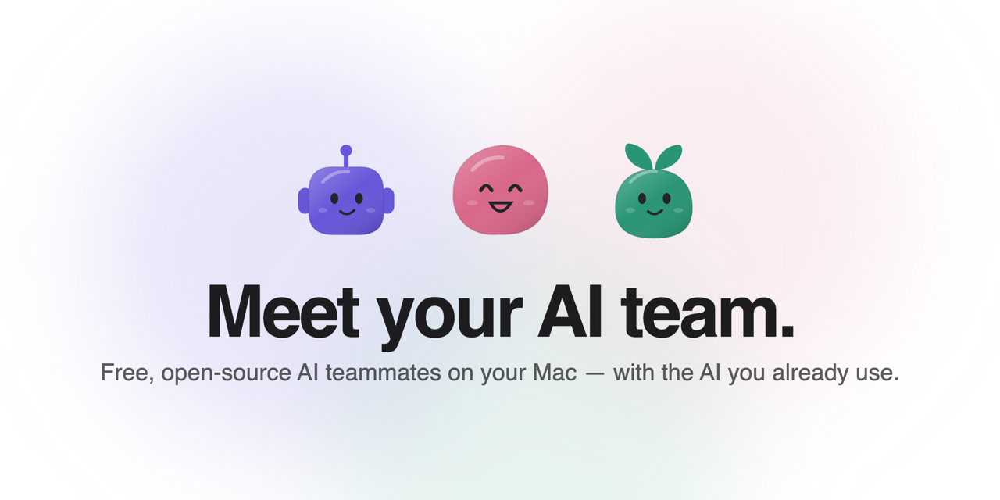
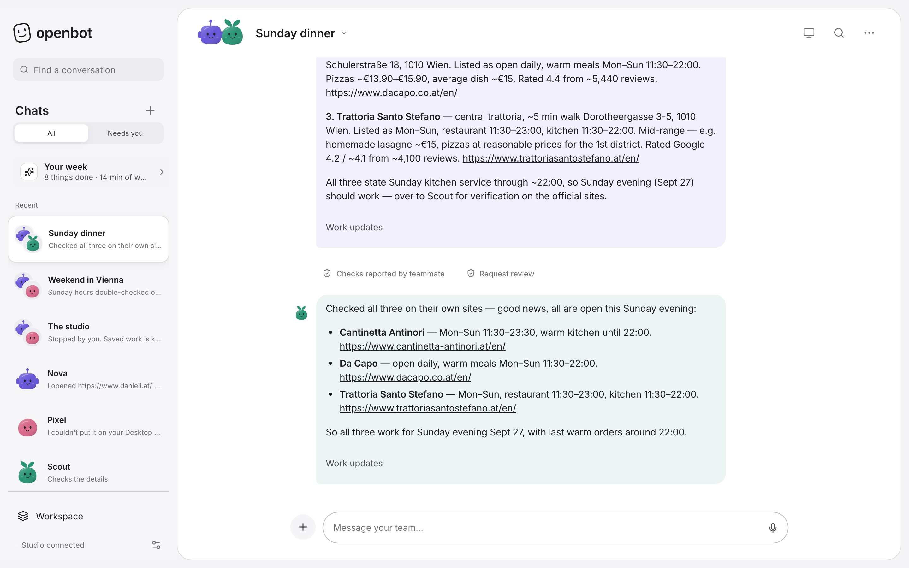
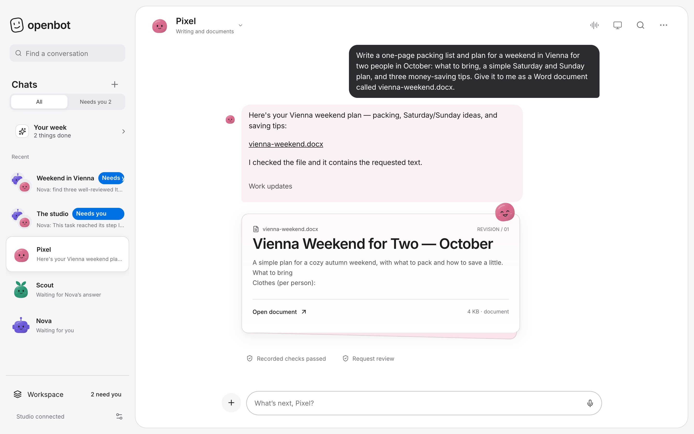
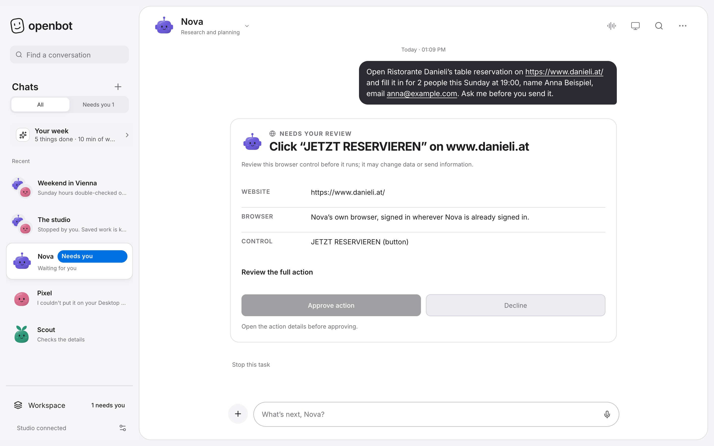

<p align="center">
  <picture>
    <source media="(prefers-color-scheme: dark)" srcset="site/social-dark.png" />
    
  </picture>
</p>

<h1 align="center">OpenBot</h1>

<p align="center">
  <strong>A small team of AI teammates on your Mac.</strong><br />
  They research, write and get things done — and ask before anything important.<br />
  Free, open source, and powered by the AI you already use.
</p>

<p align="center">
  <a href="https://openbots.foundation">Website</a> ·
  <a href="#try-it">Try it</a> ·
  <a href="#what-it-does">What it does</a> ·
  <a href="#how-it-compares">How it compares</a> ·
  <a href="CONTRIBUTING.md">Contribute</a>
</p>

<p align="center">
  <a href="https://github.com/PrisacariuRobert/openbot/actions/workflows/verify.yml"></a>
  <a href="LICENSE"></a>
  
  
</p>

<br />

<p align="center">
  
  <br />
  <sub>A real run: “Nova, find three Italian restaurants near Stephansplatz open on Sunday. Scout, double-check their hours.”</sub>
</p>

## Why OpenBot

Hosted AI agents rent you their computer for $20–300 a month. OpenBot gives you the same kind of team on **your** Mac, for free.

- **No new bill.** Sign in with ChatGPT, Claude or Grok you already pay for, start free with GitHub Copilot Free or a Gemini key, or run a model on your Mac.
- **A real team, not one bot.** Every teammate has a name, a job, a private workspace and its own browser. When one builds on another’s work, it waits for the answer.
- **You stay in charge.** Reading and searching just happen. Sending, buying, signing in or submitting always waits for your okay — with the website and the exact button.
- **Nothing hidden.** No account, no tracking. Your studio is a folder on your Mac, and every line of OpenBot is here.

## Try it

**One-line install** (macOS 13+, Apple silicon or Intel) — available with the first public release:

```sh
curl -fsSL https://openbots.foundation/install.sh | sh
```

No administrator password. It checks the download’s fingerprint, runs OpenBot in the background and adds it to your Dock. [Read the installer](scripts/install.sh) first if you like.

**Run from source** today (Node.js 22.13+):

```sh
git clone https://github.com/PrisacariuRobert/openbot.git
cd openbot
npm ci
npm run dev
```

Open [http://127.0.0.1:4310](http://127.0.0.1:4310), connect your AI, create a teammate and say hello.

## What it does

<table>
  <tr>
    <td width="50%"></td>
    <td width="50%"></td>
  </tr>
  <tr>
    <td><strong>Real files.</strong> Word documents, spreadsheets and plans arrive as files you can open and share. Drop in a PDF and your teammate reads it first.</td>
    <td><strong>Asks before it acts.</strong> Anything with consequences stops and shows you the website, the button and what will change. Say no and the teammate finishes honestly without it.</td>
  </tr>
</table>

- **Research with sources** — each teammate browses in its own private browser and links what it found; when something can’t be checked, it says so.
- **Group chats** — write “Nova: find… Scout, double-check…” and each does their part, in order.
- **Routines** — “Every Monday at 9, plan my week.” Plus a Sunday look back at what got done.
- **Voice and phone** — talk hands-free, or pair your iPhone with one scan to chat and approve from your Home Screen.
- **Skills** — teach a teammate a method once, or add reviewed skills from the community.
- **Bring your setup** — one-click import from Hermes Agent and OpenClaw, including automations.

## Your AI, your choice

| | |
| :--- | :--- |
| **Start free** | GitHub Copilot Free · Google Gemini (free key) |
| **Use your subscription** | ChatGPT · Claude · Grok |
| **Pay per use** | OpenCode Go · any OpenAI-compatible API |
| **Stay private** | Models on your Mac with Ollama |

Each teammate can use a different AI. OpenBot never resells tokens or adds a fee; each provider’s own terms and limits apply.

## How it compares

| | Hosted agents (Grok Bot, Meta Muse) | Developer agents (Hermes, OpenClaw) | **OpenBot** |
| :--- | :--- | :--- | :--- |
| Price | $0–300/month plans | Free + your models | **Free + your models** |
| Runs on | Their cloud | Your machine or server | **Your Mac** |
| Setup | Sign in | Terminal and config files | **One line, then an app** |
| Team of named teammates | Grok Bot | Yes | **Yes, each with its own browser** |
| Asks before acting | Yes | Configurable | **Always, with the exact action** |
| Works while your computer is off | Yes | With your own server | With your own server |
| Phone | Native apps | Varies | Home Screen web app |
| Open source | No | Yes | **Yes (MIT)** |

Competitor details as of September 2026, from their public pages. See the [full scorecard](docs/COMPETITIVE_SCORECARD_2026-09-23.md).

## Privacy and safety

Your studio, conversations and files live on your Mac. When a teammate works, what it needs is sent to the AI you chose, under that provider’s terms — pick a local model to keep everything on your Mac. Teammate browsers are separate profiles, not a security sandbox. Read the [security model](docs/SECURITY.md), and report vulnerabilities privately through [SECURITY.md](SECURITY.md).

## Status

OpenBot 0.37.0-beta.1 is a beta. The one-line installer ships with the first public release; until then, run from source. Known gaps are tracked openly in the [product gap audit](docs/PRODUCT_GAP_AUDIT.md) and the [release checklist](docs/FIRST_PUBLIC_RELEASE.md).

## What's new in 0.37.0-beta.1

- Replies appear word by word from every provider.
- Start free with GitHub Copilot Free or a Gemini key; one-line Mac installer.
- Teammates build on each other’s answers in group chats.
- Word documents, weekly recap, hands-free voice, and phone pairing with one scan.

Full notes in the [changelog](CHANGELOG.md).

## For developers

```text
Web studio (desktop + phone)  →  OpenBot service  →  teammates' runtimes
                                       │               (OpenCode, Claude Code)
                               SQLite + your files      browser · Mac access · tools
```

| Path | What lives there |
| :--- | :--- |
| `src/studio/` | The app — one interface for desktop and phone |
| `src/server/` | Service: conversations, teammates, tools, approvals, scheduling |
| `src/shared/` | Types and behavior shared by both |
| `site/` | The website and the Mac installer |
| `desktop/` | Electron shell and packaging |
| `deploy/` | Always-on hosting on your own Linux server |
| `skills/`, `mcp/` | Bundled skills and the MCP interface |

```sh
npm run verify     # guards, types, build and ~1,000 tests
npm start          # production build on 127.0.0.1:4311
```

More in the [extended reference](REFERENCE.md), [desktop guide](desktop/README.md) and [private runner guide](deploy/private-runner/README.md).

## Contributing

Issues and pull requests are welcome — especially for onboarding, reliability, accessibility and new skills. Start with [CONTRIBUTING.md](CONTRIBUTING.md).

## License

[MIT](LICENSE). Bundled dependencies keep their own notices — see [THIRD_PARTY_NOTICES.md](THIRD_PARTY_NOTICES.md).
