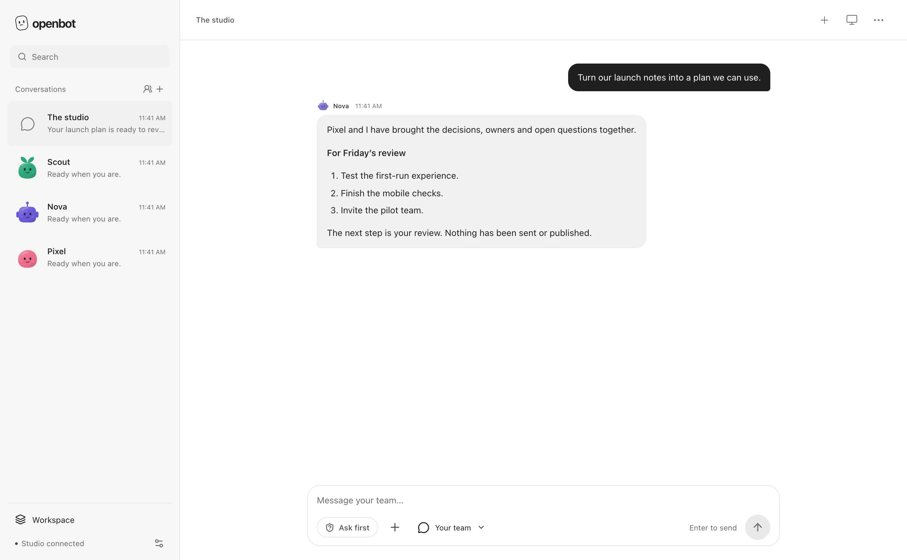

# OpenBot 0.37.0-beta.1

### Your AI team. Your models. Your workspace.

OpenBot is a local-first, open-source home for persistent AI teammates. Give each teammate a role and a supported model, then work together through conversation—from research and files to code and recurring jobs.

**[Get started](#start)** · **[Documentation](#documentation)** · **[Contributing](CONTRIBUTING.md)** · **[Security](SECURITY.md)**

[](https://github.com/PrisacariuRobert/openbot/actions/workflows/verify.yml)
[](LICENSE)



*The web Studio, captured with a synthetic workspace. This is an interface preview, not evidence of a completed real-account task. Native clients have their own interfaces.*

> [!IMPORTANT]
> **Development beta—not yet a signed public installer.** The native Mac app is the primary release target; the iPhone app is a companion preview, and the web and Electron clients use the same owner-hosted service. Public distribution and independent clean-install validation remain release gates. See the [release checklist](docs/FIRST_PUBLIC_RELEASE.md) and [candidate evidence](docs/QA_BETA_CANDIDATE.md).

## Start with a conversation

Ask a teammate to help with the work, not to explain which screen you should open.

> “Turn these notes into a project brief. Ask Scout to check the sources.”
>
> “Find this bug, make a focused fix, and show me the checks before publishing.”
>
> “Prepare a weekly review every Monday at 9.”

These are example requests, not guaranteed outcomes. The selected model, runtime, connected sources, and permissions determine what can run. Sensitive actions use the configured review policy; missing access or an uncertain outcome should remain visible.

## What OpenBot brings together

| | |
| :--- | :--- |
| **Persistent teammates** | Roles, model assignments, memory, private files, and customizable animated characters. Talk directly or work in project rooms. |
| **Collaboration with accountability** | Teammates can ask specialists for focused help while a lead returns the answer. Inspect handoffs and recorded usage. |
| **Work beyond the chat** | Connected apps, isolated browser profiles, explicitly granted Mac access, and Docker-backed computers for supported tasks. |
| **Code with context** | Connected repositories, per-task worktrees, scoped edits, recorded checks, independent review, and approval-gated new pull requests. |
| **Work over time** | Calendar routines, event triggers, and page-change monitoring, with persistent state, attention items, and recovery controls. |
| **Inspectable results** | Files and revisions stay linked to the conversation. Receipts distinguish host checks, teammate reports, sources, and unresolved uncertainty. |

The [extended reference](REFERENCE.md#what-is-included) documents the complete feature set and its boundaries. The [product gap audit](docs/PRODUCT_GAP_AUDIT.md) records work still needed; a feature appearing in source is not a reliability guarantee.

## Start

### Run the source preview

Install **Node.js 22.13 or newer**, npm, and Git, then:

```sh
git clone https://github.com/PrisacariuRobert/openbot.git
cd openbot
npm ci
npm run dev
```

Open **[http://127.0.0.1:4310](http://127.0.0.1:4310/)**. Create a teammate, choose its AI connection and model, and start with a read-only task. Older `/studio.html` links open the same Studio.

Opening the interface does not require every optional tool. Install the dependencies for the work you actually enable:

| Capability | Additional setup |
| :--- | :--- |
| Run model-backed tasks | The selected execution adapter: OpenCode for its supported connections, or the official Claude Code runtime. |
| Use websites | Google Chrome or Chromium, plus explicit browser access. |
| Run isolated computer or code checks | Docker and the relevant project dependencies. |
| Work with GitHub | GitHub CLI and your authorized account. |
| Use connected services | Service-specific setup and per-teammate permissions. |

A saved account or API key is not a successful execution test. Test the chosen connection before depending on it. OpenBot does not provide model allowance or resell tokens; provider terms, supported authentication paths, and usage limits still apply.

**[Detailed setup](REFERENCE.md#start)** · **[Model ownership](REFERENCE.md#how-model-ownership-works)** · **[Environment options](.env.example)**

### Choose a client

| Client | Role | Instructions |
| :--- | :--- | :--- |
| **Native macOS** | SwiftUI application using the authenticated backend directly; not a wrapper around the web UI. | [Build and package](macos/README.md) |
| **Web Studio** | React client served by your local or private host. | [Source setup above](#start) |
| **Electron desktop shell** | Desktop shell around the web client, with platform-specific packaging. | [Desktop setup](desktop/README.md) |
| **iPhone** | Native companion to a reachable OpenBot host. | [iPhone preview](ios/README.md) |

The native Mac source project targets macOS 14+, but clean minimum-version installation remains unverified. Follow the platform guide rather than treating a successful web build as native-app validation.

For a production-mode source run:

```sh
npm run build
npm start
```

The service normally listens on `127.0.0.1:4311`. A local routine cannot run while its host is asleep or offline. For an owner-operated Linux home, use the [private-runner guide](deploy/private-runner/README.md); that is a separate deployment, not an included hosted service.

## Your models and connected tools

Assign supported accounts, API connections, or compatible local models per teammate. Connection availability depends on the execution adapter and provider; OpenBot does not promise that every subscription works with every integration.

Built-in service paths include **GitHub, Google Workspace, Slack, Notion, Todoist, and Dropbox**. Operations and permissions differ by service. For example, Dropbox is read-only, and a connector that can create an object may not support every later edit or deletion.

- [Google Workspace setup](REFERENCE.md#connect-google-workspace)
- [Slack, Notion, Todoist, and Dropbox](REFERENCE.md#connect-slack-notion-todoist-and-dropbox)
- [Browser and connector boundaries](docs/BROWSER_AND_CONNECTORS.md)
- [Skills, MCP, and interoperability](docs/PLUGIN_INTEROPERABILITY.md)

Grant only the access the task needs. A website session is not an API grant, and a denied permission must not be bypassed by changing tools.

## Control and privacy

**Local-first means owner-hosted state—not necessarily on-device inference.** Selected prompts, files, and tool results may be sent to your chosen model provider or connected service. Review those paths before using sensitive data.

**Review consequential actions.** Keep Ask First enabled while evaluating the beta. Action previews, current account identity, and result readback matter; a completed animation or a confident response is not proof that an external action succeeded.

**Understand the boundaries.** Browser profiles are not a security sandbox. Chrome and explicitly permitted Mac app access are distinct from containerized command execution. Checks attached to a result verify specific properties, not every possible claim in that result.

**Protect the data home.** Back up the database and matching vault key together with files and required session data, following the [platform recovery instructions](macos/README.md#preserve-an-existing-studio). Never commit credentials, browser profiles, runtime databases, or unredacted diagnostics.

Read the [security model](docs/SECURITY.md) for the full threat model and limitations. Report suspected vulnerabilities through [SECURITY.md](SECURITY.md), not a public issue containing secrets.

## What's new in 0.37.0-beta.1

This beta develops the conversation-first clients, clearer task results and attention states, native controls, and the self-contained Mac development-package path. These are implementation and candidate checks—not a claim that public-release gates are complete.

See the [changelog](CHANGELOG.md), [result-flow evidence](docs/QA_RESULT_FLOW.md), and [detailed release notes](REFERENCE.md#whats-new-in-0370-beta1). Older notes remain available in the reference instead of crowding this introduction.

## Architecture

```text
Native Mac / iPhone / Web Studio / Electron
                    |
          Authenticated OpenBot service
                    |
     Conversations, tools, approvals, and runner
                    |
       SQLite state + owner-controlled files
                    |
  Model adapters / connectors / browser / computers
```

The service owns execution, permission checks, scheduling, recovery, and persisted results. Clients present that state; they do not grant authority by displaying a button.

| Path | Purpose |
| :--- | :--- |
| `src/studio/` | Web conversation UI and management screens. |
| `src/server/` | Host runtime, database, tools, connectors, and approvals. |
| `src/shared/` | Shared types and behavior contracts. |
| `macos/`, `ios/`, `desktop/` | Native clients and the Electron shell. |
| `skills/`, `mcp/` | Included skills and the OpenBot MCP interface. |
| `scripts/`, `tests/` | Verification, packaging, and workflow fixtures. |
| `deploy/` | Owner-hosted deployment and recovery tooling. |
| `marketing/` | Website and editable introduction-film sources. |

## Development

Use the checked-in lockfile; keep changes focused and test with disposable data.

```sh
npm run verify
npm run test:conversation-flow
npm run test:studio-polish
node scripts/check-static-assets.mjs
```

`verify` includes source guards, TypeScript, the web build, and unit tests. Native source-contract checks are **not** Xcode builds, device tests, or signed-package installation tests. Browser checks require Chrome/Chromium. Actual-model and live-account tests need separate authorization and an explicit usage budget.

Read [CONTRIBUTING.md](CONTRIBUTING.md) before opening a PR. Bug reports should include the version, client, reproduction, and redacted evidence. Improvements to reliability, onboarding, accessibility, and complete task workflows are especially useful.

## Documentation

| Topic | Guide |
| :--- | :--- |
| Complete feature catalog, setup, and earlier release notes | [Extended reference](REFERENCE.md) |
| Public-beta scope and remaining release gates | [First public release](docs/FIRST_PUBLIC_RELEASE.md) |
| Current candidate record | [Beta candidate evidence](docs/QA_BETA_CANDIDATE.md) |
| Product gaps and next priorities | [Product gap audit](docs/PRODUCT_GAP_AUDIT.md) |
| Security and permissions | [Security model](docs/SECURITY.md) |
| Private always-on hosting | [Private runner](deploy/private-runner/README.md) |
| Asset ownership and cleanup rules | [Asset maintenance](docs/ASSET_MAINTENANCE.md) |
| Contribution and verification expectations | [Contributing](CONTRIBUTING.md) |

## License

OpenBot is available under the [MIT License](LICENSE). Bundled dependencies, fonts, and service marks retain their own notices; see [THIRD_PARTY_NOTICES.md](THIRD_PARTY_NOTICES.md).
