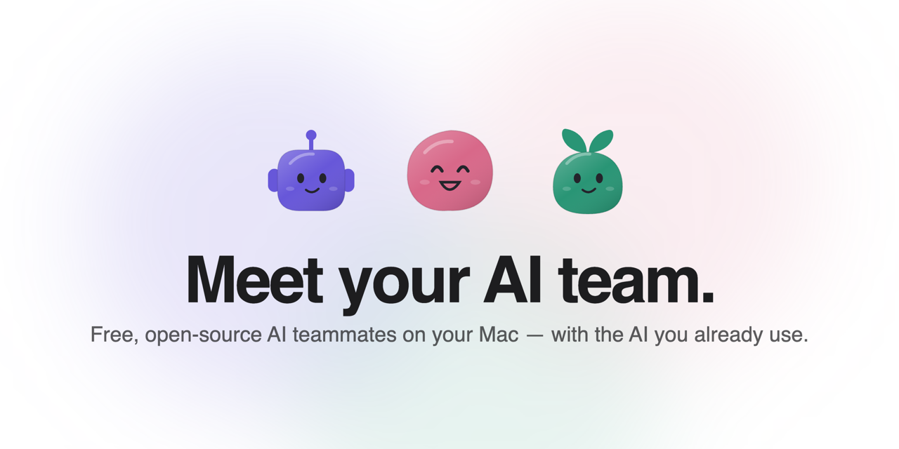
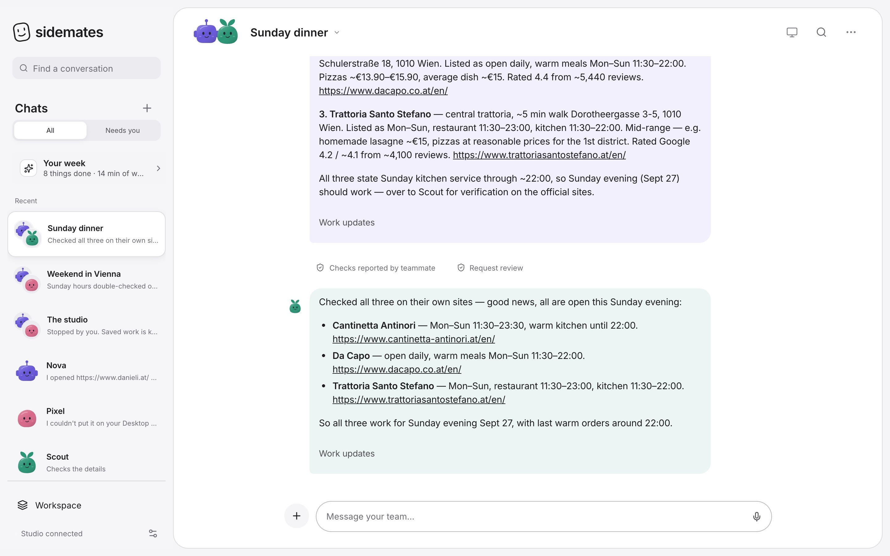
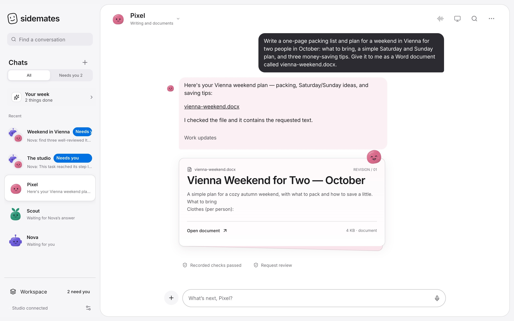
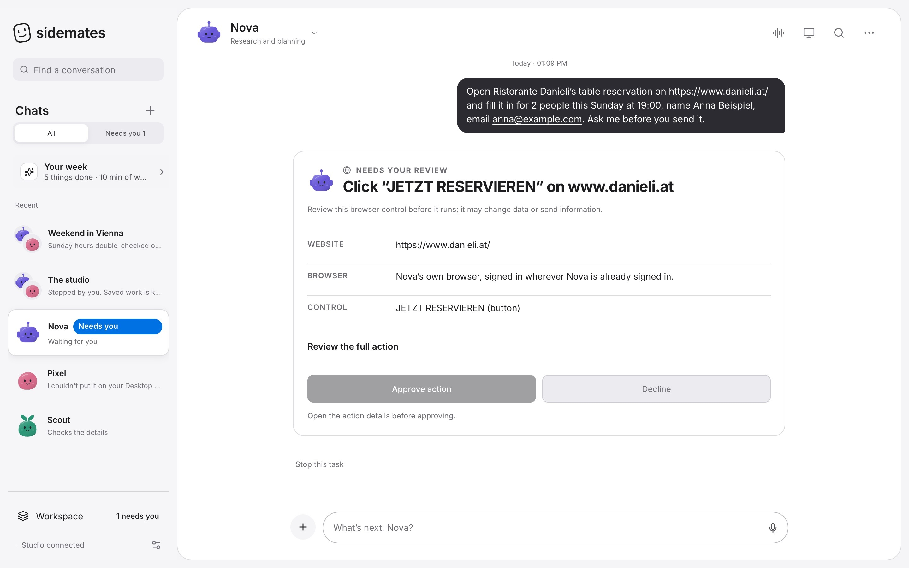

<p align="center">
  <picture>
    <source media="(prefers-color-scheme: dark)" srcset="site/social-dark.png" />
    
  </picture>
</p>

<h1 align="center">Sidemates</h1>

<p align="center">
  <strong>The open-source alternative to OpenAI dots, Grok Bot and Siri AI.</strong><br />
  A small team of AI teammates on your Mac. They work in your own Mail, Calendar and Notes — and ask before anything important.<br />
  Free, open source, and powered by the AI you already use.<br />
  <sub>Sidemates was called OpenBot until October 2026.</sub>
</p>

<p align="center">
  <a href="https://sidemates.app">Website</a> ·
  <a href="#try-it">Try it</a> ·
  <a href="#what-it-does">What it does</a> ·
  <a href="#how-it-compares">How it compares</a> ·
  <a href="CONTRIBUTING.md">Contribute</a>
</p>

<p align="center">
  <a href="https://github.com/PrisacariuRobert/sidemates/actions/workflows/verify.yml"></a>
  <a href="LICENSE"></a>
  
  
</p>

<br />

<p align="center">
  
  <br />
  <sub>A real run: “Nova, find three Italian restaurants near Stephansplatz open on Sunday. Scout, double-check their hours.”</sub>
</p>

## Why Sidemates

Hosted AI agents rent you their computer for $20–300 a month. Sidemates gives you the same kind of team on **your** Mac, for free.

- **No new bill.** Sign in with the ChatGPT, Grok or GitHub Copilot plan you already pay for, use Claude through the Claude Code you already have installed (or an API key), start free with a Gemini key, or run a model on your Mac.
- **A real team, not one bot.** Every teammate has a name, a job, a private workspace and its own browser. When one builds on another’s work, it waits for the answer.
- **You stay in charge.** Reading and searching just happen. Sending, buying, signing in or submitting waits for your okay by default — with the website and the exact button. Trust a teammate completely? Turn on **Autopilot** for it.
- **Nothing hidden.** No account, no tracking. Your studio is a folder on your Mac, and every line of Sidemates is here.

## Try it

**One-line install** (macOS 13+, Apple silicon or Intel):

```sh
curl -fsSL https://sidemates.app/install.sh | sh
```

No administrator password. It checks the download’s fingerprint, runs Sidemates in the background and adds it to your Dock. [Read the installer](scripts/install.sh) first if you like.

**Or run from source** (Node.js 22.13+):

```sh
git clone https://github.com/PrisacariuRobert/sidemates.git
cd sidemates
npm ci
npm run dev
```

Open [http://127.0.0.1:4310](http://127.0.0.1:4310), connect your AI, create a teammate and say hello.

## What it does

<table>
  <tr>
    <td width="50%"></td>
    <td width="50%"></td>
  </tr>
  <tr>
    <td><strong>Real files.</strong> Word documents, spreadsheets and plans arrive as files you can open and share. Drop in a PDF and your teammate reads it first.</td>
    <td><strong>Asks before it acts.</strong> Anything with consequences stops and shows you the website, the button and what will change. Say no and the teammate finishes honestly without it. Prefer no questions? Autopilot, per teammate, is off until you turn it on, and even then money, the first message to someone new, anything that can't be undone, publishing, and passwords and cards still ask.</td>
  </tr>
</table>

- **Research with sources** — each teammate browses in its own private browser and links what it found; when something can’t be checked, it says so.
- **Group chats** — write “Nova: find… Scout, double-check…” and each does their part, in order.
- **Routines** — “Every Monday at 9, plan my week.” Plus a Sunday look back at what got done.
- **Voice and phone (beta)** — talk hands-free in the studio. From your phone, chat with your team through Telegram, or use the Home Screen app with a relay you set up; pairing with one scan is on the way.
- **Skills** — teach a teammate a method once, or add reviewed skills from the community.
- **Bring your setup** — one-click import from Hermes Agent and OpenClaw, including automations.

## Your AI, your choice

| | |
| :--- | :--- |
| **Start free** | Google Gemini (free key — a Google account, no card) |
| **Use your subscription** | ChatGPT · Grok · GitHub Copilot (Pro, Pro+, Business) |
| **Use Claude** | Through the Claude Code you already have installed and signed in, or with an API key |
| **Pay per use** | OpenCode Go · any OpenAI-compatible API |
| **Stay private** | Models on your Mac with Ollama |

Each teammate can use a different AI. Sidemates never resells tokens or adds a fee; each provider’s own terms and limits apply. For Claude, Sidemates starts your own `claude` command and never sees your login. Anthropic’s terms allow signing in to the unmodified Claude Code program with your own subscription ([checked 7 October 2026](https://code.claude.com/docs/en/legal-and-compliance)). Use by tools that start it may count against your plan differently, so check your plan before relying on it.

## How it compares

| | Cloud agents (OpenAI dots, Grok Bot, Meta Muse) | Siri AI (macOS 27) | Hermes Desktop, OpenClaw | **Sidemates** |
| :--- | :--- | :--- | :--- | :--- |
| Price | Free with caps (Muse) to $100+/month (dots); Grok Bot from $20–30 | Free, with daily limits | Free + your models | **Free + your models** |
| Runs on | Their cloud computers; Muse for Mac and dots (if you turn it on) also act on your Mac | Your Mac + Apple's cloud | Your machine | **Your Mac** |
| Uses your Mac's apps and files | Muse for Mac (US and Canada only); dots, if you turn it on; not Grok Bot | Personal context and quick actions | Files and scripts | **Mail, Calendar, files, apps — with your okay** |
| Long jobs on websites | Yes, in their browser | No | Yes | **Yes, each teammate in its own browser** |
| A team of named teammates | Grok Bot only | No | Hermes Bot Mode | **Yes** |
| Scheduled work | Yes | No | Yes | **Yes, while your Mac is awake** |
| Asks before acting | Yes | Yes | Configurable | **By default, with the exact button — or Autopilot** |
| Choose your AI | No | No | Yes | **Yes — ChatGPT, Claude, Gemini, local…** |
| Open source | No | No | Yes (MIT) | **Yes (MIT)** |

Siri is great for quick questions — Sidemates is for the whole job, and works with Siri (“Hey Siri, Ask Sidemates”). OpenAI dots’ personal plans aren’t offered in the EU, UK or Switzerland, and Meta’s Muse is available only in the US and Canada; Sidemates works wherever your Mac does. Competitor details as of 7 October 2026, from their public pages and press. See the [full scorecard](docs/COMPETITIVE_SCORECARD_2026-09-23.md).

## Privacy and safety

Your studio, conversations and files live on your Mac. When a teammate works, what it needs is sent to the AI you chose, under that provider’s terms — pick a local model to keep everything on your Mac. Teammate browsers are separate profiles, not a security sandbox. Read the [security model](docs/SECURITY.md), and report vulnerabilities privately through [SECURITY.md](SECURITY.md).

## Status

Sidemates 0.42.0 is a public beta ([release notes](https://github.com/PrisacariuRobert/sidemates/releases/tag/v0.42.0)). Known gaps are tracked openly in the [product gap audit](docs/PRODUCT_GAP_AUDIT.md) and the [roadmap](docs/ROADMAP.md).

Sidemates has no token or cryptocurrency. Anyone selling one in its name is not us.

## Coming in the next release

These are in the code but not in a release yet. The [changelog](CHANGELOG.md) has the details.

- **A guided first run**: choose your AI, meet your first teammate, and get three things to try.
- **A free Gemini key in a few clicks**, tested as soon as you paste it, and a private browser download for computers without Chrome, Edge or Brave.
- **Lighter requests to your AI**: a teammate's "hi" sends about 40% less, measured offline.
- **Install without Terminal**, from a disk image for your kind of Mac.
- **Gmail and Google Calendar through the Mac's own Mail and Calendar**, without a Google Cloud project.
- **Your setup** in Settings: a timeline of your first days that stays on your Mac.
- **When a job can't finish**, you see what's missing and the one-click fix.
- **Hard stops, even on Autopilot**: money, the first message to someone new, anything that can't be undone, publishing, and passwords and cards always ask.
- **Submit a teammate to the gallery** from its settings, without Git.
- **Ask my Mac**: a shortcut from anywhere on the Mac to ask about your own mail, notes and files, with every answer citing its source and nothing sent to a cloud AI.
- **Your saved secrets' key in the Keychain** on a Mac, instead of a file next to the data.
- **Memory you can trace**: every memory says where it came from, and facts learned from mail, web pages or files wait for your review before any task uses them.
- **Skills you can trust**: risky lines listed before you add a skill, every skill pinned to the version you reviewed with a diff before updates, and scripts off until you turn them on.
- **Private mode**: personal details become placeholders before a cloud AI sees them and come back on your Mac, and every task's receipt shows exactly what was sent, what it used and what it cost.
- **Shared results carry "Make this teammate"**, so whoever reads one can add the same teammate, and the page previews with the teammate's face.
- **Your Mac reacts**: automations that start when a file lands in a folder or mail like this arrives.
- **A teammate can suggest a specialist** (a researcher or a writer) when a job needs one; it's added only if you approve.
- **Published attack tests**: what a prompt injection can and can't make a teammate do, run on every change ([security model](docs/SECURITY.md#attack-tests-what-we-test-and-what-still-gets-through)).

## What's new in 0.42.0

- **OpenBot is now Sidemates.** A new name and a new home at [sidemates.app](https://sidemates.app). OpenBot was too close to other products' names, so we changed it early. Updating keeps your teammates, chats and files, and the old install link still works.
- **macOS asks for permissions again** (Mail, Calendar, Full Disk Access), because the app now has a new name and identity. It is the same app asking once more.
- Shared teammates and skills use `.sidemates` file names. Files and links from before still import.

Everything earlier is in the [changelog](CHANGELOG.md) and the [releases](https://github.com/PrisacariuRobert/sidemates/releases).

## For developers

```text
Web studio (desktop + phone)  →  Sidemates service  →  teammates' runtimes
                                       │               (OpenCode, Claude Code)
                               SQLite + your files      browser · Mac access · tools
```

| Path | What lives there |
| :--- | :--- |
| `src/studio/` | The app — one interface for desktop and phone |
| `src/server/` | Service: conversations, teammates, tools, approvals, scheduling |
| `src/shared/` | Types and behavior shared by both |
| `site/` | The website and the Mac installer |
| `desktop/` | Electron shell and packaging |
| `deploy/` | Always-on hosting on your own Linux server |
| `skills/`, `mcp/` | Bundled skills and the MCP interface |

```sh
npm run verify               # guards, types, build and ~1,100 tests
npm run build && npm start   # production build on 127.0.0.1:4311
```

More in the [docs](docs/README.md), [desktop guide](desktop/README.md) and [private runner guide](deploy/private-runner/README.md).

## Contributing

Issues and pull requests are welcome — especially for onboarding, reliability, accessibility and new skills. Start with [CONTRIBUTING.md](CONTRIBUTING.md).

## License

[MIT](LICENSE). Bundled dependencies keep their own notices — see [THIRD_PARTY_NOTICES.md](THIRD_PARTY_NOTICES.md).
